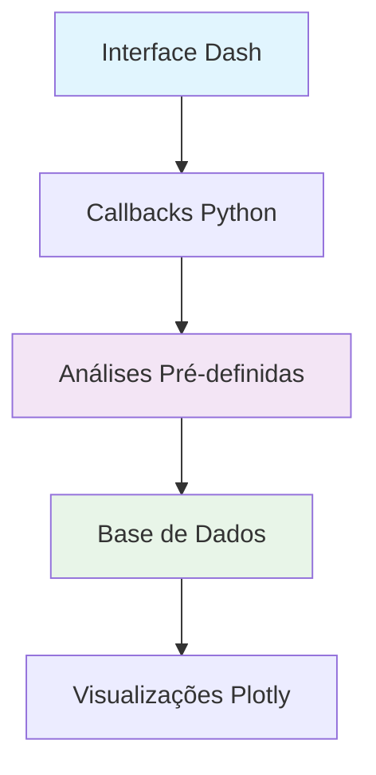
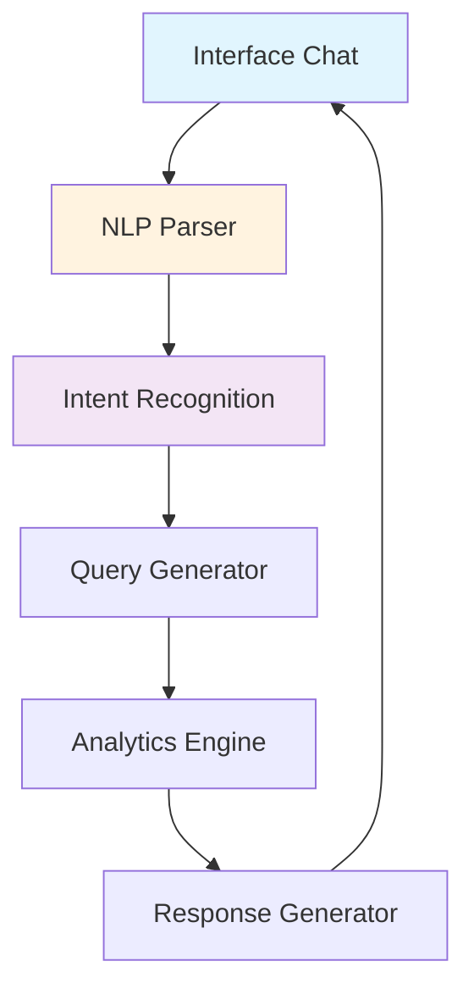
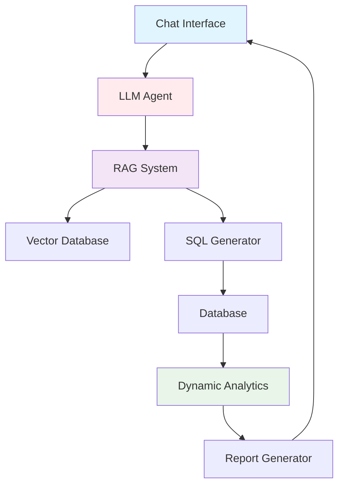

# 🤖 ROADMAP: AGENTE DE IA CONVERSACIONAL - DASHBOARD WEG

## 🎯 VISÃO ESTRATÉGICA

Evolução do Dashboard WEG de um sistema de análises pré-definidas para um **Agente de IA Conversacional** capaz de:
- ✅ Responder perguntas em linguagem natural sobre os dados
- ✅ Gerar análises personalizadas sob demanda
- ✅ Criar relatórios customizados automaticamente
- ✅ Fornecer insights proativos baseados em padrões identificados

---

## 📅 CRONOGRAMA DE EVOLUÇÃO

### **FASE 1: FUNDAÇÃO (ATUAL - Q4 2025)**
**Status: ✅ CONCLUÍDO**
```
🔧 Sistema Heurístico Implementado
├── Análises pré-definidas (Gaps, Sazonalidade, Inatividade)
├── Sistema de feedback estruturado
├── Interface interativa com exportação
└── Base de dados consolidada

💡 Próximos Passos Imediatos:
├── Melhorar qualidade dos dados
├── Expandir conjunto de análises
└── Coletar feedback dos usuários
```

### **FASE 2: INTELIGÊNCIA BÁSICA (Q1 2026)**
**Status: 🔄 PLANEJADO**
```
🧠 Implementação de NLP Básico
├── Parser de perguntas em português
├── Mapeamento pergunta → análise
├── Respostas estruturadas em linguagem natural
└── Interface de chat integrada

🎯 Funcionalidades Alvo:
├── "Qual foi o faturamento em janeiro?"
├── "Quem são os top 5 clientes do ano?"
├── "Mostre produtos em declínio"
└── "Gere relatório de vendas por região"
```

### **FASE 3: IA CONVERSACIONAL (Q2-Q3 2026)**
**Status: 📋 PLANEJADO**
```
🤖 Agente Conversacional Completo
├── LLM local ou API (GPT-4/Claude)
├── RAG (Retrieval Augmented Generation)
├── Context awareness entre perguntas
└── Geração dinâmica de análises

🎯 Capacidades Avançadas:
├── Análises multi-dimensionais sob demanda
├── Comparações temporais complexas
├── Insights preditivos
└── Relatórios executivos automáticos
```

### **FASE 4: IA PROATIVA (Q4 2026)**
**Status: 🔮 FUTURO**
```
🚀 Agente Autônomo e Proativo
├── Monitoramento contínuo de anomalias
├── Alertas inteligentes automáticos
├── Sugestões proativas de análises
└── Aprendizado de preferências do usuário

🎯 Recursos Avançados:
├── "Detectei uma anomalia nas vendas de motores"
├── "Sugiro analisar impacto da sazonalidade"
├── "Relatório executivo semanal gerado"
└── "Oportunidade cross-sell identificada"
```

---

## 🏗️ ARQUITETURA TÉCNICA EVOLUTIVA

### **ATUAL: Modelo Heurístico**


### **FASE 2: NLP Básico**


### **FASE 3: IA Conversacional**


---

## 💡 ESPECIFICAÇÕES TÉCNICAS POR FASE

### **FASE 2: NLP Básico**

#### **Tecnologias Core**
```python
# NLP Processing
import spacy  # Para português brasileiro
import re     # Regex patterns
from fuzzywuzzy import fuzz  # Matching aproximado

# Intent Recognition
INTENTS = {
    'faturamento': ['faturamento', 'vendas', 'receita', 'valor'],
    'clientes': ['cliente', 'comprador', 'consumidor'],
    'produtos': ['produto', 'material', 'item'],
    'temporal': ['mês', 'ano', 'período', 'data'],
    'ranking': ['top', 'maior', 'melhor', 'principal']
}

# Query Templates
QUERY_TEMPLATES = {
    'faturamento_periodo': "SELECT SUM(vlr_rol) FROM vendas WHERE data_faturamento BETWEEN {start} AND {end}",
    'top_clientes': "SELECT cliente, SUM(vlr_rol) FROM vendas GROUP BY cliente ORDER BY SUM(vlr_rol) DESC LIMIT {n}",
    'produtos_tendencia': "SELECT produto, COUNT(*) FROM vendas WHERE data_faturamento >= {date} GROUP BY produto"
}
```

#### **Parser de Perguntas**
```python
class NLPParser:
    def __init__(self):
        self.nlp = spacy.load("pt_core_news_sm")
        
    def parse_question(self, question: str) -> dict:
        """
        Exemplos de parsing:
        
        "Qual foi o faturamento em janeiro?" 
        → {intent: 'faturamento', temporal: 'janeiro', type: 'sum'}
        
        "Quem são os top 5 clientes?"
        → {intent: 'clientes', ranking: 5, type: 'top'}
        
        "Mostre produtos em declínio"
        → {intent: 'produtos', trend: 'declining', type: 'analysis'}
        """
        doc = self.nlp(question.lower())
        
        intent = self._extract_intent(doc)
        entities = self._extract_entities(doc)
        parameters = self._extract_parameters(doc)
        
        return {
            'intent': intent,
            'entities': entities,
            'parameters': parameters,
            'confidence': self._calculate_confidence(doc)
        }
```

### **FASE 3: IA Conversacional**

#### **Integração com LLM**
```python
# Opções de LLM
LLM_OPTIONS = {
    'local': {
        'model': 'ollama/llama3.1',
        'pros': ['Privacidade', 'Sem custos API', 'Controle total'],
        'cons': ['Requer GPU', 'Setup complexo']
    },
    'api': {
        'model': 'openai/gpt-4o',
        'pros': ['Performance superior', 'Setup simples'],
        'cons': ['Custos por token', 'Dependência externa']
    },
    'hybrid': {
        'model': 'local + api fallback',
        'pros': ['Melhor de ambos', 'Backup disponível'],
        'cons': ['Complexidade arquitetural']
    }
}

class ConversationalAgent:
    def __init__(self, llm_provider="hybrid"):
        self.llm = self._init_llm(llm_provider)
        self.vector_db = self._init_vector_database()
        self.context_manager = ConversationContext()
        
    async def process_query(self, user_input: str) -> str:
        """
        Pipeline completo:
        1. Retrieve context relevante (RAG)
        2. Construir prompt com dados
        3. LLM gera resposta + SQL se necessário
        4. Executar queries no banco
        5. Formatar resposta final
        """
        
        # RAG: Buscar contexto relevante
        context = await self.vector_db.similarity_search(user_input)
        
        # Construir prompt estruturado
        prompt = self._build_prompt(user_input, context)
        
        # LLM processing
        response = await self.llm.generate(prompt)
        
        # Executar queries se necessário
        if response.has_sql:
            data = await self._execute_sql_safely(response.sql)
            response = self._format_with_data(response, data)
            
        return response.text
```

#### **RAG System (Retrieval Augmented Generation)**
```python
class RAGSystem:
    def __init__(self):
        self.embeddings = SentenceTransformer('all-MiniLM-L6-v2')
        self.vector_store = ChromaDB()
        
    def index_knowledge_base(self):
        """
        Indexar conhecimento sobre:
        - Esquema do banco de dados
        - Regras de negócio WEG
        - Análises frequentes
        - Padrões de consulta
        """
        
        knowledge_base = [
            "Tabela vendas contém vlr_rol (faturamento), data_faturamento, cliente, produto",
            "vlr_entrada representa valor de entrada/margem na venda",
            "Sazonalidade WEG concentra vendas no 2º semestre (ago-dez)",
            "Clientes inativos: >90 dias sem compra = atenção, >365 dias = crítico",
            # ... mais conhecimento específico
        ]
        
        for text in knowledge_base:
            embedding = self.embeddings.encode(text)
            self.vector_store.add(text, embedding)
```

### **FASE 4: IA Proativa**

#### **Sistema de Monitoramento Contínuo**
```python
class ProactiveAgent:
    def __init__(self):
        self.monitors = [
            AnomalyDetector(),
            TrendAnalyzer(), 
            OpportunityScanner(),
            PerformanceTracker()
        ]
        
    async def continuous_monitoring(self):
        """
        Executa em background:
        - A cada hora: verifica anomalias
        - Diariamente: analisa tendências
        - Semanalmente: gera insights
        - Mensalmente: relatórios executivos
        """
        
        while True:
            for monitor in self.monitors:
                alerts = await monitor.check()
                
                if alerts:
                    await self._generate_proactive_insights(alerts)
                    
            await asyncio.sleep(3600)  # 1 hora
            
    async def _generate_proactive_insights(self, alerts):
        """
        Exemplos de insights proativos:
        
        🚨 "Detectei queda de 15% nas vendas de motores esta semana"
        💡 "Cliente XYZ não compra há 120 dias, sugerir contato"
        📈 "Oportunidade: 5 clientes cotaram inversores mas não compraram"
        📊 "Padrão sazonal indica aumento de demanda nos próximos 30 dias"
        """
```

---

## 🎯 CASOS DE USO PRÁTICOS

### **FASE 2: Perguntas Estruturadas**
```
👤 "Qual foi o faturamento de janeiro?"
🤖 "O faturamento de janeiro de 2025 foi R$ 2.847.392,00, representando um crescimento de 12% em relação ao mesmo período do ano anterior."

👤 "Quem são os top 5 clientes?"
🤖 "Os 5 maiores clientes por faturamento são:
    1. Cliente ABC - R$ 458.239,00
    2. Cliente XYZ - R$ 392.847,00
    3. Cliente DEF - R$ 284.736,00
    4. Cliente GHI - R$ 247.583,00
    5. Cliente JKL - R$ 195.842,00"

👤 "Mostre produtos em declínio"
🤖 "Identifiquei 3 produtos com declínio nas vendas:
    • Motor 5CV: -23% vs mês anterior
    • Transformador 10KVA: -15% vs mês anterior  
    • Contator 25A: -8% vs mês anterior"
```

### **FASE 3: Conversação Avançada**
```
👤 "Analise o desempenho dos motores nos últimos 6 meses"
🤖 "Análise de Motores (Mar-Set 2025):

📊 Faturamento Total: R$ 1.247.392,00 (+8% vs período anterior)
📈 Tendência: Crescimento constante exceto julho (-12% sazonal)
🏆 Top Performers: Motor 2CV (35% do total), Motor 5CV (22%)
⚠️ Atenção: Motor 15CV com declínio de 18%

Deseja que eu gere um relatório detalhado ou analise algum modelo específico?"

👤 "Sim, me mostre mais detalhes do Motor 15CV"
🤖 "Motor 15CV - Análise Detalhada:

📉 Evolução: R$ 89.245 (Mar) → R$ 73.156 (Set) = -18%
👥 Clientes: 15 compradores (vs 22 no período anterior)
🔄 Última venda: 03/09/2025 (Cliente Industrial ABC)
💡 Insight: Concorrência crescente + mudança tecnológica
📋 Ação sugerida: Revisar pricing e estratégia comercial

Posso gerar um plano de ação comercial para este produto?"
```

### **FASE 4: Insights Proativos**
```
🤖 "🚨 ALERTA AUTOMÁTICO
Detectei uma anomalia nos dados de hoje:

• Vendas de inversores: 67% abaixo da média diária
• Possível causa: Sistema ERP offline 09:00-11:00h
• Impacto estimado: R$ 45.000 em vendas perdidas
• Ação recomendada: Verificar integridade dos dados

Deseja que eu gere um relatório de impacto completo?"

🤖 "💡 INSIGHT SEMANAL
Padrão interessante identificado:

• 8 clientes cotaram 'Soft-Starter 45A' esta semana
• Apenas 1 compra realizada (conversão: 12,5%)
• Média histórica de conversão: 34%
• Oportunidade estimada: R$ 127.000

Posso preparar uma campanha de follow-up automática?"
```

---

## 🛠️ PREPARAÇÃO TÉCNICA IMEDIATA

### **1. Estrutura de Dados para IA**
```python
# Melhorar esquema do banco para IA
def prepare_ai_schema():
    """
    Adicionar tabelas de contexto:
    - conversation_history
    - user_preferences  
    - ai_insights_log
    - query_patterns
    """
    
# Criar índices para performance
CREATE INDEX idx_vendas_temporal ON vendas(data_faturamento, produto);
CREATE INDEX idx_vendas_cliente ON vendas(cod_cliente, vlr_rol);
CREATE INDEX idx_cotacoes_conversao ON cotacoes(material, cod_cliente, data);
```

### **2. API Structure para IA**
```python
# Estrutura modular para fácil integração
class AIReadyAnalytics:
    """
    Versão atual das análises preparada para IA:
    - Métodos padronizados
    - Outputs estruturados
    - Metadados ricos
    """
    
    def get_available_analyses(self) -> List[Dict]:
        return [
            {
                'name': 'gaps_oportunidade',
                'description': 'Identifica oportunidades de venda baseado em gaps',
                'parameters': ['filtro_ano', 'filtro_cliente', 'top_n'],
                'output_format': 'dataframe',
                'ai_friendly': True
            },
            # ... outras análises
        ]
    
    def execute_analysis(self, analysis_name: str, **params) -> Dict:
        """
        Executar análise com output preparado para IA:
        - Dados estruturados
        - Metadados explicativos
        - Insights em linguagem natural
        """
```

### **3. Começar Coleta de Dados para IA**
```python
# Implementar logging de interações
class UserInteractionLogger:
    def log_analysis_request(self, user_id, analysis_type, parameters, timestamp):
        """
        Coletar padrões de uso para treinar IA:
        - Análises mais solicitadas
        - Padrões temporais de uso
        - Preferências por tipo de visualização
        """
        
    def log_export_patterns(self, user_id, data_exported, format_chosen):
        """
        Entender como usuários consomem dados:
        - Formatos preferidos (CSV, PDF, Excel)
        - Frequência de exportação
        - Dados mais relevantes
        """
```

---

## 📋 PRÓXIMOS PASSOS IMEDIATOS

### **Sprint 1 (Próximas 2 semanas)**
```
✅ Implementar logging de interações do usuário
✅ Criar estrutura de dados para contexto IA
✅ Documentar todas as análises atuais em formato AI-friendly
✅ Definir API contracts para futuro agente
```

### **Sprint 2 (Próximo mês)**
```
🔄 Protótipo de chat interface básico
🔄 Parser simples para perguntas estruturadas
🔄 Mapeamento pergunta → análise existente
🔄 Testes com usuários beta
```

### **Q1 2026**
```
📋 Implementação completa Fase 2
📋 Integração com LLM (local ou API)
📋 RAG system básico
📋 Beta release do agente conversacional
```

---

## 💎 VALOR ESTRATÉGICO

### **Diferencial Competitivo**
- **Dashboard tradicional** → **Assistente inteligente**
- **Relatórios estáticos** → **Insights dinâmicos**
- **Análise reativa** → **Inteligência proativa**

### **ROI Esperado**
- **Redução 70%** no tempo de geração de relatórios
- **Aumento 40%** na utilização de dados para decisões
- **Melhoria 60%** na identificação de oportunidades
- **Autonomia 90%** dos usuários para análises básicas

### **Impacto Organizacional**
- Democratização do acesso aos dados
- Decisões mais rápidas e fundamentadas
- Redução da dependência de analistas para consultas simples
- Foco da equipe técnica em problemas complexos

---

## 🎯 CONCLUSÃO

Este roadmap posiciona o Dashboard WEG na vanguarda da **Business Intelligence conversacional**. Começamos com fundações sólidas (modelo heurístico atual) e evoluímos sistematicamente para um agente de IA completo.

**Foco Imediato:** Preparar arquitetura e dados para IA
**Objetivo 2026:** Agente conversacional completo operacional
**Visão 2027:** IA proativa sendo referência no mercado

---

*"A melhor forma de prever o futuro é criá-lo. Vamos construir o futuro da análise de dados na WEG!"* 🚀
